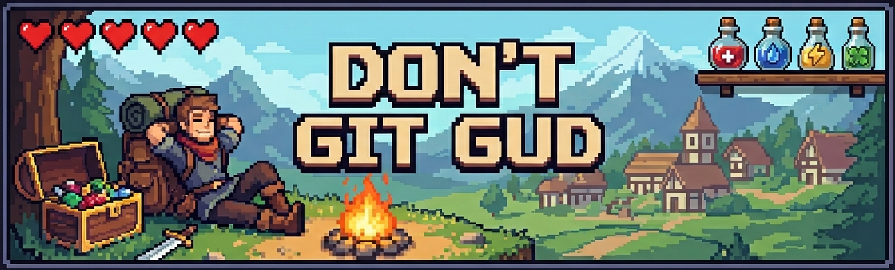

#### Check for things you dislike in games using LLMs before you pick your next game.
[kulvind3r.github.io/DontGitGud](https://kulvind3r.github.io/DontGitGud/)

### How to Use

1. Open the link above and select a set of features that you hate in games like 
    - excessive grinding 
    - bad checkpoints 
    - ubisoft like trash collectibles littered across large world maps
    - \<your own custom dealbreaker\>

2. Give one or more game names to check for them.
3. Use the one click button to copy a well designed prompt for AI.
4. Open one of the linked AI sites and paste the prompt to get a detailed answer and a % chance if you will like / dislike the game.

### Tech stack
Plain HTML, CSS, JS. 

Simple one page web site with responsive design usable on mobile screens. Remembers your selection of deal breakers across uses.

### Customize and Self Host

- Add your own dealbreakers in `script.js => DEALBREAKERS_DATA`
- Run `./build.ps1` (windows) or `./build.sh` (linux) to generate the site.
- Open `index.html` from the generated `build` directory and bookmark it in your browser.

